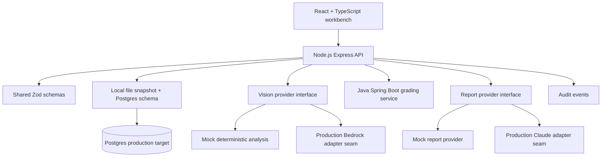

# InspectIQ

AI-assisted vehicle inspection and condition report platform.

InspectIQ models a wholesale/offsite vehicle inspection workflow: capture required vehicle photos, run advisory image analysis, require human confirmation, calculate a deterministic condition grade, draft a condition report, prepare buyer-visible disclosure, and preserve an audit trail.

## Why I Built It

I built this to show practical understanding of inspection/imaging systems: image ingestion, evidence completeness, damage documentation, deterministic condition grading, AI-assisted drafting, human review, auditability, and AWS-ready workflow design.

It does not use Cox Automotive branding, proprietary data, or unlicensed assets. Vehicle records are synthetic, and bundled sample photos use license-safe public image sources documented in `sample-data/IMAGE_CREDITS.md`.

## Business Problem

Wholesale condition reports need consistent photo evidence, clear damage facts, explainable grading, buyer trust, seller disclosure, and accountable review. AI can speed up inspection workflows, but it should not silently become the source of truth. InspectIQ keeps AI advisory and makes reviewers confirm facts before they affect grade, CR readiness, VDP visibility, reconditioning estimates, or report output.

## Product Walkthrough

1. Open the dashboard and choose an inspection.
2. Create a new inspection when needed.
3. Use the Inspector role to attach required photo evidence or upload vehicle photos.
4. Run image analysis and validate the structured AI output.
5. Switch to the Reviewer role for suggestions labelled `AI suggestion - requires human confirmation`.
6. Accept, reject, or edit suggestions.
7. Confirmed photo-angle suggestions update required evidence completeness.
8. Accepted damage candidates become human-confirmed damage items.
9. Check CR readiness, VDP readiness, buyer-visible status, reconditioning estimate, and arbitration risk.
10. Calculate the condition grade from confirmed evidence.
11. Generate a schema-validated AI report draft.
12. Edit and finalize the report as a reviewer.
13. Review the audit trail and Platform Health scorecard.

## Architecture



## Scope

This is a working portfolio application, not a claimed production inspection platform. Local and Cloudflare Pages workflows use deterministic AI providers and lightweight persistence so the end-to-end flow is reliable without paid model credentials. The repo includes Postgres schema, Drizzle table definitions, Terraform skeleton, provider interfaces, and AWS design notes to show the production direction.

## Tech Stack

- React, TypeScript, Vite, React Router, CSS.
- Node.js, Express, Zod, structured logging, request IDs.
- Shared TypeScript schemas.
- Java Spring Boot grading service.
- Postgres schema and Drizzle table definitions.
- Local file snapshot persistence plus Cloudflare KV snapshot support for hosted Pages.
- S3-style image storage interface.
- Step Functions-style async report job model.
- Provider interfaces with deterministic mock AI implementations.
- Vitest, Supertest, React Testing Library, JUnit.
- Terraform AWS skeleton.

## Local Setup

```bash
npm install
npm run dev
```

Open:

- Web: `http://localhost:5173`
- API health: `http://localhost:4000/api/health`

Optional Java service:

```bash
cd services/grading-java
mvn spring-boot:run
```

The API falls back to equivalent local grading rules when the Java service is not running so the portfolio workflow remains usable.

## Environment Variables

Copy `.env.example` to `.env` if you want to customize:

- `PORT`
- `WEB_ORIGIN`
- `DATABASE_URL`
- `VISION_PROVIDER=mock|bedrock`
- `REPORT_PROVIDER=mock|bedrock`
- `GRADING_SERVICE_URL`
- `PERSISTENCE_MODE=file|memory`
- `INSPECTIQ_STORE_FILE`

## API Examples

```bash
curl http://localhost:4000/api/inspections

curl -X POST http://localhost:4000/api/inspections \
  -H 'content-type: application/json' \
  -d '{"vin":"5NMJBCAE4RH123456","year":2024,"make":"Hyundai","model":"Tucson","trim":"SEL","mileage":14250,"exteriorColor":"Gray","sellerSource":"Wholesale offsite lane","inspectorName":"John Smith"}'
```

All responses use:

```json
{
  "data": {},
  "requestId": "..."
}
```

Errors use:

```json
{
  "error": {
    "code": "VALIDATION_FAILED",
    "message": "Request validation failed."
  },
  "requestId": "..."
}
```

## Database Schema Overview

The Postgres schema covers:

- `users`
- `inspections`
- `vehicle_photos`
- `photo_analysis_results`
- `vision_suggestions`
- `damage_items`
- `condition_grades`
- `ai_report_jobs`
- `ai_report_drafts`
- `final_reports`
- `audit_events`

See `apps/api/src/db/schema.sql` and `apps/api/src/db/drizzle-schema.ts`.

## State Machine

The API enforces the documented state machine in `apps/api/src/stateMachine.ts`.

```txt
DRAFT -> NEEDS_PHOTOS -> READY_FOR_GRADING -> GRADED -> AI_DRAFT_PENDING
AI_DRAFT_PENDING -> AI_DRAFTED | HUMAN_REVIEW_REQUIRED | REPORT_FAILED
AI_DRAFTED -> FINALIZED | HUMAN_REVIEW_REQUIRED
HUMAN_REVIEW_REQUIRED -> FINALIZED | AI_DRAFT_PENDING
REPORT_FAILED -> AI_DRAFT_PENDING
```

`FINALIZED` is terminal for normal users.

## Image Analysis Workflow

Local:

1. Attach required photo evidence or upload a vehicle photo.
2. Run the vision provider.
3. Validate output with `VisionOutputSchema`.
4. Save raw and validated output separately.
5. Create pending suggestions.
6. Human reviewer accepts, rejects, or edits.

AWS target:

```txt
S3 upload -> EventBridge/SQS -> Image worker -> Bedrock multimodal model
-> schema validation -> Postgres suggestions -> audit event
```

## AI Report Workflow

Local report jobs complete immediately through `mockReportProvider`, but the data model is async-ready:

```txt
Generate report -> ai_report_jobs -> gather confirmed facts -> provider call
-> schema validation -> ai_report_drafts -> human review or AI_DRAFTED
```

AI never finalizes reports.

## Human-In-The-Loop Governance

- Suggestions stay pending until reviewed.
- Edited suggestions remain review records until a reviewer explicitly accepts them.
- Only accepted suggestions become facts.
- Damage candidates create damage items only after acceptance.
- Low confidence or missing evidence forces human review.
- Finalization requires valid state and complete evidence.
- Audit trail records decisions and state changes.

## Testing

```bash
npm test
npm run test:e2e
npm run typecheck
npm run lint
npm run build
```

The API tests cover the full create-to-finalize flow, schema validation failures, evidence completeness gates, AI suggestion review, audit trail events, and post-finalization immutability guards. The browser E2E script covers create -> attach photos -> analyze -> reviewer acceptance -> grade -> draft report -> finalize -> audit verification through the rendered React app.

Java tests:

```bash
cd services/grading-java
mvn test
```

## Observability

Implemented locally:

- Request IDs.
- Structured logs.
- Provider names and prompt versions in records.
- Audit events for key decisions.
- Platform Health scorecard.

Production metrics include image analysis success rate, missing required angle rate, human review rate, grade generation latency, report finalization rate, suggestion acceptance rate, and p95 API latency.

## Security

Local review uses role-aware UI controls and API RBAC for Inspector, Reviewer, and Admin workflows. Production design should use Cognito or enterprise OIDC, JWT validation, object-level authorization, S3 presigned uploads, encrypted S3/RDS, Secrets Manager, least-privilege IAM, and CloudTrail.

## AWS Deployment Architecture

The simple production AWS shape is:

```txt
React
-> API Gateway + Lambda or ECS
-> Neon Free Postgres or Aurora Postgres
-> S3 image objects
-> SQS/EventBridge image jobs
-> image worker
-> Bedrock/Rekognition/custom model
-> validated suggestions
-> audit trail
```

The `infra/terraform` skeleton covers the main resource categories, but it is not a one-command production deployment. A real deployment still needs account-specific networking, service packaging, IAM policies, alarms, Bedrock model access, and environment promotion.

## Cost Awareness

Major drivers:

- S3 image storage.
- Multimodal image-analysis calls.
- Report-generation tokens.
- API/worker compute.
- Aurora/RDS baseline.
- CloudWatch logs.

For 1,000 inspections with 10 images each, model calls dominate variable cost. The project uses mock providers locally to avoid accidental spend and documents idempotency to prevent duplicate jobs.

## Failure Handling

Handled or documented:

- Unsupported file type validation.
- Provider failure records.
- Invalid schema rejection.
- Unknown photo angle routing.
- Duplicate analysis handling.
- Missing evidence before grading.
- Report job failure and retry path.
- Finalization state guards.
- Double-submit finalization idempotency.

## Production Tradeoffs

I would discuss:

- Replace the local file/KV snapshot repository with Postgres before multiple reviewers, real uploads, or audit retention matter.
- Keep Java grading separate only if condition rules are independently owned, versioned, or reused outside the Node API.
- Use ECS/Fargate for long-running image/report workers when model calls, retries, or native image tooling outgrow Lambda limits.
- Treat Bedrock output as untrusted input: validate schemas, store raw and validated output, and require human confirmation before facts affect reports.
- Use presigned S3 uploads with MIME validation, object-level authorization, checksum capture, and lifecycle policies.
- Add reviewer queues and SLA metrics only after the core evidence-to-report workflow is stable.
- Put audit events in durable relational storage with append-only conventions before using this for compliance.

## Future Improvements

- Full Postgres repository implementation behind the existing schema.
- Real presigned S3 upload flow.
- Bedrock Claude and multimodal provider implementation.
- Reviewer queue with assignment and SLA filters.
- Thumbnail generation and image metadata extraction.
- CloudWatch dashboard templates.
- Cross-browser frontend flow tests.

## Resume Bullets

See `docs/resume-bullets.md` for short, technical, and business-impact versions.
