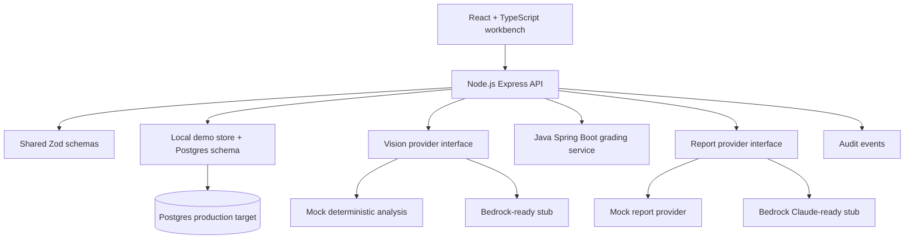

# InspectIQ

AI-assisted vehicle inspection and condition report platform.

InspectIQ is a portfolio project that models an enterprise inspection and imaging workflow: upload or select vehicle photos, run advisory image analysis, require human confirmation, calculate a deterministic grade, draft a condition report, and preserve an audit trail.

## Why I Built It

I built this to show practical understanding of inspection/imaging systems: image ingestion, evidence completeness, damage documentation, deterministic condition grading, AI-assisted drafting, human review, auditability, and AWS-ready workflow design.

It does not use Cox Automotive branding, proprietary data, or copyrighted assets. All vehicles and images are synthetic.

## Business Problem

Vehicle condition reports need consistent photo evidence, clear damage facts, explainable grading, and accountable review. AI can speed up inspection workflows, but it should not silently become the source of truth. InspectIQ keeps AI advisory and makes reviewers confirm facts before they affect grade or report output.

## Product Walkthrough

1. Open the dashboard and choose a seeded inspection.
2. Create a new inspection when needed.
3. Attach generated sample images or upload image metadata.
4. Analyze photos with the local mock vision provider.
5. Review suggestions labelled `AI suggestion - requires human confirmation`.
6. Accept, reject, or edit suggestions.
7. Confirmed photo-angle suggestions update required evidence completeness.
8. Accepted damage candidates become human-confirmed damage items.
9. Run deterministic grading through the Java service interface.
10. Generate a schema-validated AI report draft.
11. Edit and finalize the report as a reviewer.
12. Review the audit trail and Platform Health scorecard.

## Architecture



## Tech Stack

- React, TypeScript, Vite, React Router, CSS.
- Node.js, Express, Zod, structured logging, request IDs.
- Shared TypeScript schemas.
- Java Spring Boot grading service.
- Postgres schema and Drizzle table definitions.
- S3-style sample image storage.
- Step Functions-style async report job model.
- Mock Bedrock/Claude provider abstractions.
- Vitest, Supertest, React Testing Library, JUnit.
- Terraform AWS skeleton.

## Local Setup

```bash
npm install
npm run dev
```

Open:

- Web: `http://localhost:5173`
- API health: `http://localhost:4000/api/health`

Optional Java service:

```bash
cd services/grading-java
mvn spring-boot:run
```

The API falls back to equivalent local grading rules when the Java service is not running so the portfolio demo remains usable.

## Environment Variables

Copy `.env.example` to `.env` if you want to customize:

- `PORT`
- `WEB_ORIGIN`
- `DATABASE_URL`
- `VISION_PROVIDER=mock|bedrock`
- `REPORT_PROVIDER=mock|bedrock`
- `GRADING_SERVICE_URL`

## API Examples

```bash
curl http://localhost:4000/api/inspections

curl -X POST http://localhost:4000/api/inspections \
  -H 'content-type: application/json' \
  -d '{"vin":"SYNTHVIN24DEMO01","year":2024,"make":"Hyundai","model":"Tucson","trim":"SEL","mileage":14250,"exteriorColor":"Gray","sellerSource":"Dealer trade","inspectorName":"Demo Inspector"}'
```

All responses use:

```json
{
  "data": {},
  "requestId": "..."
}
```

Errors use:

```json
{
  "error": {
    "code": "VALIDATION_FAILED",
    "message": "Request validation failed."
  },
  "requestId": "..."
}
```

## Database Schema Overview

The Postgres schema covers:

- `users`
- `inspections`
- `vehicle_photos`
- `photo_analysis_results`
- `vision_suggestions`
- `damage_items`
- `condition_grades`
- `ai_report_jobs`
- `ai_report_drafts`
- `final_reports`
- `audit_events`

See `apps/api/src/db/schema.sql` and `apps/api/src/db/drizzle-schema.ts`.

## State Machine

The API enforces the documented state machine in `apps/api/src/stateMachine.ts`.

```txt
DRAFT -> NEEDS_PHOTOS -> READY_FOR_GRADING -> GRADED -> AI_DRAFT_PENDING
AI_DRAFT_PENDING -> AI_DRAFTED | HUMAN_REVIEW_REQUIRED | REPORT_FAILED
AI_DRAFTED -> FINALIZED | HUMAN_REVIEW_REQUIRED
HUMAN_REVIEW_REQUIRED -> FINALIZED | AI_DRAFT_PENDING
REPORT_FAILED -> AI_DRAFT_PENDING
```

`FINALIZED` is terminal for normal users.

## Image Analysis Workflow

Local:

1. Attach sample image metadata.
2. Run `mockVisionProvider`.
3. Validate output with `VisionOutputSchema`.
4. Save raw and validated output separately.
5. Create pending suggestions.
6. Human reviewer accepts, rejects, or edits.

AWS target:

```txt
S3 upload -> EventBridge/SQS -> Image worker -> Bedrock multimodal model
-> schema validation -> Postgres suggestions -> audit event
```

## AI Report Workflow

Local report jobs complete immediately through `mockReportProvider`, but the data model is async-ready:

```txt
Generate report -> ai_report_jobs -> gather confirmed facts -> provider call
-> schema validation -> ai_report_drafts -> human review or AI_DRAFTED
```

AI never finalizes reports.

## Human-In-The-Loop Governance

- Suggestions stay pending until reviewed.
- Only accepted or edited suggestions become facts.
- Damage candidates create damage items only after acceptance.
- Low confidence or missing evidence forces human review.
- Finalization requires valid state and complete evidence.
- Audit trail records decisions and state changes.

## Testing

```bash
npm test
npm run typecheck
npm run build
```

Java tests:

```bash
cd services/grading-java
mvn test
```

## Observability

Implemented locally:

- Request IDs.
- Structured logs.
- Provider names and prompt versions in records.
- Audit events for key decisions.
- Platform Health scorecard.

Production metrics include image analysis success rate, failed analysis count, report latency, report failures, human review rate, AI suggestion acceptance/rejection rate, and p95 API latency.

## Security

Local demo uses a role selector. Production design should use Cognito or enterprise OIDC, JWT validation, RBAC, S3 presigned uploads, object-level authorization, encrypted S3/RDS, Secrets Manager, least-privilege IAM, and CloudTrail.

## AWS Deployment Architecture

The `infra/terraform` skeleton includes S3, SQS, CloudWatch, Secrets Manager, Aurora Postgres, and Step Functions. A production deployment would add VPC wiring, ECS/Fargate or Lambda packaging, API Gateway or ALB routing, IAM policies, alarms, and Bedrock permissions.

## Cost Awareness

Major drivers:

- S3 image storage.
- Multimodal image-analysis calls.
- Report-generation tokens.
- API/worker compute.
- Aurora/RDS baseline.
- CloudWatch logs.

For 1,000 inspections with 10 images each, model calls dominate variable cost. The project uses mock providers locally to avoid accidental spend and documents idempotency to prevent duplicate jobs.

## Failure Handling

Handled or documented:

- Unsupported file type validation.
- Provider failure records.
- Invalid schema rejection.
- Unknown photo angle routing.
- Duplicate analysis handling.
- Missing evidence before grading.
- Report job failure and retry path.
- Finalization state guards.
- Double-submit finalization idempotency.

## Production Tradeoffs

I would discuss:

- When to replace the in-memory demo store with a Postgres repository.
- Whether Java grading deserves its own service or should be collapsed.
- Lambda vs ECS/Fargate for API and workers.
- Bedrock prompt/schema guardrails.
- Presigned image upload security.
- Reviewer workload queues and SLA metrics.
- Audit event durability requirements.

## Future Improvements

- Full Postgres repository implementation behind the existing schema.
- Real presigned S3 upload flow.
- Bedrock Claude and multimodal provider implementation.
- Reviewer queue with assignment and SLA filters.
- Thumbnail generation and image metadata extraction.
- CloudWatch dashboard templates.
- More frontend flow tests.

## Resume Bullets

See `docs/resume-bullets.md` for short, technical, and business-impact versions.

