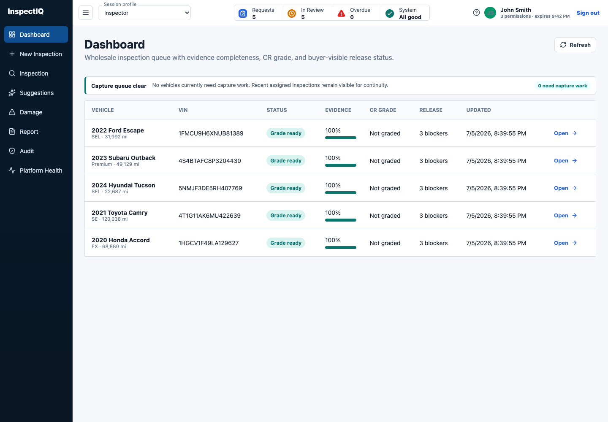
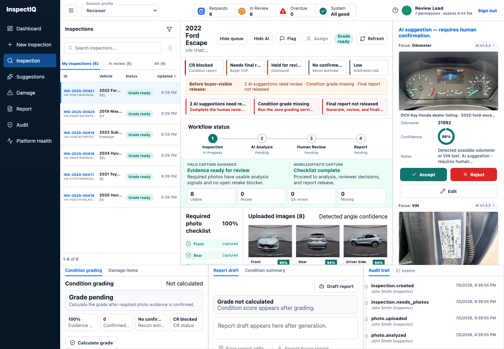

# InspectIQ

[](https://github.com/manynames3/inspectiq/actions/workflows/ci.yml)

Vehicle inspection, condition-report, and reconditioning operations workflow for wholesale and offsite vehicles.

[Live app](https://inspectiq.pages.dev) | [No-login review](https://inspectiq.pages.dev/?review=1) | [Architecture](docs/architecture.md) | [Production boundary](docs/implementation-boundary.md)

InspectIQ helps auction-facility teams move a vehicle from check-in through evidence capture, a human-reviewed condition report, consignor-controlled recon, quality control, and sale release. AI suggests; a human decides what becomes a vehicle fact.

## The Problem

Wholesale condition reports break down when evidence is incomplete or inconsistent:

- required angles are missing or unusable;
- VIN and odometer evidence cannot be verified;
- reviewers spend time finding the right photo for each issue;
- damage descriptions and recon estimates vary by reviewer;
- recon recommendations are mistaken for permission to spend consignor money;
- revised estimates and failed quality control are difficult to track against a sale deadline;
- buyers cannot trace a disclosure back to its evidence and approval history.

InspectIQ keeps condition facts, spending decisions, authorized work, quality control, release blockers, and audit history in one workflow.

## Users

| Role | Primary job |
| --- | --- |
| Inspector | Capture required evidence, resolve retakes, and submit photos for analysis. |
| Reviewer | Confirm, edit, or reject findings; grade the vehicle; approve the report. |
| Recon Coordinator | Prepare estimates, submit authorization requests, and coordinate authorized work and QC. |
| Consignor Approver | Approve, decline, or request revision for represented consignor accounts. |
| Technician | Update assigned, authorized facility work orders. |
| Admin | Manage policies, exceptions, platform health, and recovery. |

## Workflow

1. Create or receive an assigned inspection.
2. Capture the required vehicle angles on web or mobile and cross-check a complete VIN through NHTSA vPIC when needed.
3. Upload privately to S3 and queue analysis through SQS.
4. Validate Bedrock output against a strict schema.
5. Record direct Inspector observations with source attribution; require a Reviewer decision before an AI candidate becomes confirmed damage or identity evidence.
6. Approve the 0.0–5.0 InspectIQ Reference Grade and publish an immutable report version.
7. Create recon recommendations and illustrative estimates without treating them as authorization.
8. Apply a snapshotted Consignor Authorization Policy or route the item to a Consignor Approver.
9. Generate work orders only for authorized items, block overruns for reauthorization, and record QC.
10. Release the vehicle only when the backend sale-readiness assessment has no blockers.

## Product Views

| Inspection queue | Inspection workbench |
| --- | --- |
|  |  |

Operational views:

- **Recon Operations:** compare published or preliminary CR scores, confirmed repair exposure, authorization state, work progress, and sale blockers in one queue;
- **Recon Decisions:** scope estimates and preserve the distinction between a recommendation, consignor authorization, and executable work; and
- **Shop Board:** track authorized work, estimate overruns, reauthorization, and quality control.

## Live Proof

| Proof | Evidence |
| --- | --- |
| Public walkthrough | The [Evaluation Workspace](https://inspectiq.pages.dev/?review=1) requires no credentials; Reviewer/Admin findings and manual damage entries are isolated to the browser session. |
| Authenticated workflow | Cognito roles separate inspection, review, recon, consignor approval, technician, and administrative actions. See [role-separated proof](docs/role-separated-proof.md). |
| Real image analysis | A Copart marketplace photo moved through private S3, SQS, Lambda, Bedrock, schema validation, and Reviewer acceptance before becoming a confirmed damage record. See [the recorded model trace](evals/marketplace-bedrock-proof.json). |
| CR and recon comparison | The live Recon Operations queue contrasts a published 4.7 CR with no confirmed repair findings and `$0` recon against a preliminary 4.1 CR with confirmed rear damage and a `$1,200–$2,500` repair range. The range comes from confirmed damage, not a score-to-dollar lookup. |
| Vehicle reference | NHTSA vPIC decodes a complete VIN into reference metadata. It is not a vehicle-history report, proprietary condition score, or replacement for evidence review. |
| Operations | Platform Health exposes queue state, outbox delivery, EventBridge/DLQ status, projector health, model usage, and recovery controls. |
| Verification | CI runs TypeScript, Python, Postgres integration, browser E2E, responsive visual regression, mobile component checks, Android APK build and emulator E2E, and Terraform checks. |

The marketplace run is one traceable workflow proof, not an accuracy benchmark. The source image is not committed to this repository.
Review decisions and damage entries created in the Evaluation Workspace stay in browser session storage and never mutate the production inspection record.

## Architecture


```text
React web / Expo mobile
        |
    Cognito JWT
        |
API Gateway -> Node.js Lambda -> Neon Postgres
        |              |
        |              +-> outbox -> EventBridge -> Python projector -> DynamoDB
        |              +-> consignor policy -> authorized work -> QC -> sale readiness
        |
        +-> private S3 -> SQS -> image worker Lambda -> Bedrock
```

### Service Boundaries

- **Neon Postgres** is the business system of record.
- **S3** stores private photo evidence; clients use presigned uploads and short-lived previews.
- **SQS** isolates image upload from model latency and supports retry and DLQ recovery.
- **Bedrock** returns advisory angle, quality, OCR, and damage findings.
- **NHTSA vPIC** supplies VIN-decoded reference metadata; it does not supply AutoCheck data, ownership history, or a condition score.
- **EventBridge** carries versioned domain events from the transactional outbox.
- **DynamoDB** holds idempotency records, operational timelines, and model-usage reservations. It is not a second business database.
- **CloudWatch and X-Ray** cover logs, metrics, traces, alarms, and the operations dashboard.

Condition grade and operational urgency are separate: grade describes the vehicle; urgency prioritizes facility work. The CR score provides comparison context, while recon cost comes from confirmed findings and coordinator-scoped work rather than a score-to-dollar lookup. Recon recommendations, authorization decisions, and work orders remain separate because the facility recommends work while the consignor retains economic control. See the [inspection-to-recon workflow](docs/inspection-recon-workflow.md) and [authorization policy](docs/recon-authorization-policy.md).

Why other AWS services were deferred is documented in [ADR 0009](docs/adr/0009-aws-orchestration-and-vision-services.md).

## AI Boundary

Bedrock is an advisory provider, not the source of truth.

- Raw and validated model output are stored separately.
- Invalid output fails schema validation.
- Model, prompt, latency, token, cost, and fallback metadata are recorded.
- VIN or odometer text is not accepted unless it is legible and reviewed.
- Damage candidates become damage items only after Reviewer acceptance or correction.
- Buyer-facing reports exclude model payloads and internal confidence details.

Local development uses deterministic providers so tests remain repeatable. The deployed path uses S3, SQS, Lambda, and Bedrock with the same contracts.

Read the [image-analysis contract](docs/image-analysis-contract.md), [AI governance notes](docs/ai-governance.md), and [model evaluation report](docs/model-evaluation-report.md).

## Mobile Capture

The Expo/React Native client provides:

- required-angle camera overlays;
- post-capture resolution, exposure, glare, and blur guidance;
- offline photo storage in the application sandbox;
- SQLite-backed upload operations with stable IDs and checksums;
- bounded retry and visible blocked-upload states;
- Cognito Authorization Code + PKCE and SecureStore sessions.

Only capture works offline. Review, grading, reporting, and administrative mutations require a connection.

## Quick Start

```bash
cp .env.example .env
npm ci
npm run seed
npm run dev
```

Requirements, environment setup, repository structure, and verification commands are in the [developer workflow](docs/developer-workflow.md).

## Current Limits

InspectIQ is a working reference implementation with a live AWS backend. It is not a commercial inspection service.

- The 108-image challenge corpus is useful for contract regression, not statistical field validation.
- One live marketplace damage result does not establish production precision or recall.
- Mobile angle selection is inspector-driven; there is no deployed on-device angle classifier yet.
- Damage findings do not yet include reviewer-adjustable image regions or segmentation.
- The current buyer export is not yet a polished PDF and photo package.
- Generic CSV and signed webhook integrations are not implemented.
- Some Postgres flows still hydrate the in-memory domain store; high-concurrency use would require direct aggregate repositories.
- Seeded repair costs, durations, grade lift, and authorization limits are illustrative rather than a commercial repair-pricing database.
- The InspectIQ Reference Grade is not Manheim AutoGrade, MMR, or another proprietary score.
- Commercial use requires rights-cleared field data, security review, customer integration work, and a controlled inspector pilot.

External marketplace evidence is source-attributed and stored privately for workflow proof. Marketplace images are not redistributed in this repository and remain subject to their source terms.

## Documentation

- [Implementation boundary](docs/implementation-boundary.md)
- [Inspection-to-recon workflow](docs/inspection-recon-workflow.md)
- [Recon authorization policy](docs/recon-authorization-policy.md)
- [Recon API examples](docs/inspection-recon-api.md)
- [Five-minute recon walkthrough](docs/inspection-recon-demo.md)
- [Production readiness](docs/production-readiness.md)
- [Engineering iterations](docs/engineering-iterations.md)
- [Architecture and tradeoffs](docs/architecture.md)
- [State machine](docs/state-machine.md)
- [Security](docs/security.md)
- [Observability](docs/observability.md)
- [Runbook](docs/runbook.md)
- [Live production proof](docs/live-production-proof.md)
