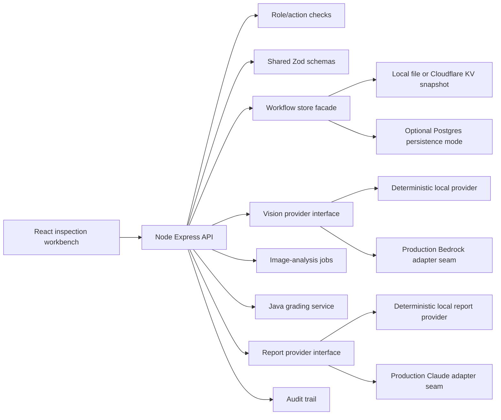

# Architecture

InspectIQ is a production-shaped inspection workflow implemented as a monorepo with a React/Vite workbench, TypeScript Express API, shared Zod schemas, optional Postgres persistence, and a narrow Java grading service boundary.

The architecture is intentionally boring where reliability matters: explicit state transitions, schema-validated model output, append-style audit events, deterministic grading, role-aware actions, and backend-derived readiness blockers. The AI path is advisory by design; it accelerates review without silently becoming the source of truth.

## Runtime Shape



## Product Flow

```txt
Create inspection
-> capture required photo evidence
-> queue image analysis
-> validate angle, quality, damage, OCR, confidence, and estimate output
-> create advisory suggestions
-> reviewer accept/edit/reject
-> confirmed damage and evidence update readiness
-> deterministic grade
-> AI-assisted report draft from confirmed facts
-> reviewer finalization
-> buyer-ready report export
-> audit trail and metrics
```

## Core Boundaries

| Boundary | Why it exists |
| --- | --- |
| Shared schemas | Keep API, UI, provider output, and tests aligned around explicit contracts. |
| Vision provider | Swap deterministic local analysis for Bedrock/Rekognition/custom models without changing reviewer workflow. |
| Image-analysis jobs | Model queue/retry/idempotency even when local analysis completes immediately. |
| Java grading service | Show how deterministic condition rules can be versioned and owned separately when justified. |
| Readiness blockers | Keep CR/VDP/buyer-visible release decisions backend-derived instead of UI-only. |
| Audit events | Preserve a defensible chain of custody for AI suggestions, human decisions, grading, and finalization. |

## Data Ownership

Postgres tables are shaped around operational facts rather than UI screens:

- `inspections` own vehicle intake and workflow status.
- `vehicle_photos` own object metadata, declared/detected angle, quality, and analysis status.
- `image_analysis_jobs` own queued/running/completed/failed/dead-letter execution state.
- `photo_analysis_results` store raw and validated provider output separately.
- `vision_suggestions` remain advisory until a reviewer accepts or edits them.
- `damage_items`, `condition_grades`, `ai_report_drafts`, and `final_reports` represent confirmed downstream facts.
- `audit_events` record reviewer and system decisions.

## Production Deployment Shape

```txt
React workbench
-> API Gateway + Lambda or ECS/Fargate API
-> Postgres repository with transaction-scoped writes
-> presigned S3 uploads
-> S3/EventBridge or API-created image-analysis jobs
-> SQS queue
-> Lambda/ECS image worker
-> Bedrock/Rekognition/custom model
-> VisionOutputSchema validation
-> suggestions + audit trail
-> reviewer workflow
```

The local workflow uses deterministic providers so it works without paid credentials. The data model, endpoints, and Terraform skeleton map to Postgres, S3, SQS/EventBridge, Step Functions, workers, and Bedrock/Rekognition/custom models in AWS. The local repository persists server state to `.inspectiq/local-store.json`; Cloudflare Pages can persist to KV; production should use per-operation Postgres transactions.

## Failure Posture

The system is designed around recoverable workflow failures:

- unsupported image files fail validation before persistence;
- provider failures create failed analysis records and audit events;
- schema rejection prevents untrusted model output from becoming suggestions;
- retake-required image quality blocks buyer-visible release;
- unreviewed suggestions block release;
- finalization is terminal for normal workflow users;
- E2E tests prove the rendered app can complete create -> analyze -> review -> grade -> finalize -> export.
