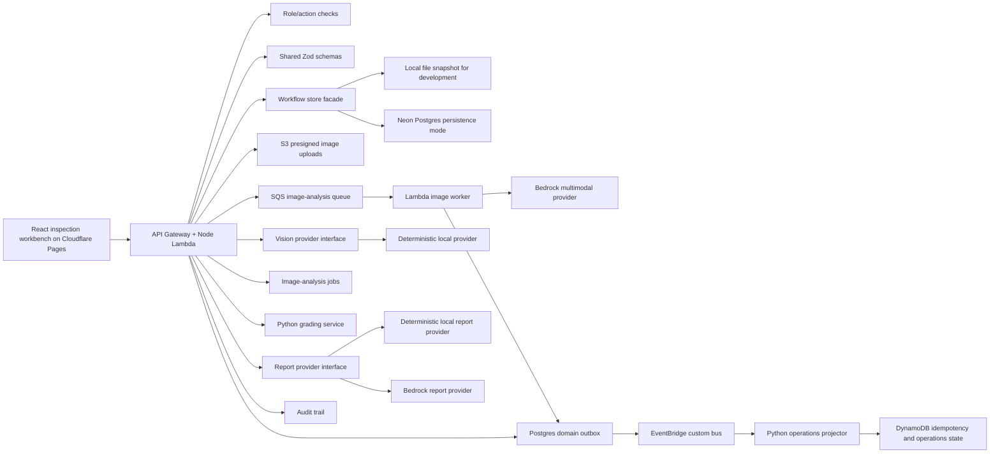

# Architecture

InspectIQ is a production-shaped inspection workflow implemented as a monorepo with React/Vite web, Expo/React Native mobile, a TypeScript Express Lambda API/worker, shared Zod schemas, Neon Postgres, a Python operations-projector Lambda, and a narrow optional Python grading boundary.

The architecture is intentionally boring where reliability matters: explicit state transitions, schema-validated model output, append-style audit events, deterministic grading, role-aware actions, and backend-derived readiness blockers. The AI path is advisory by design; it accelerates review without silently becoming the source of truth.

## Runtime Shape



## Product Flow

```txt
Create inspection
-> capture required photo evidence
-> queue image analysis
-> validate angle, quality, damage, OCR, confidence, and estimate output
-> create advisory suggestions
-> reviewer accept/edit/reject
-> confirmed damage and evidence update readiness
-> deterministic grade
-> AI-assisted report draft from confirmed facts
-> reviewer version approval
-> explicit finalization confirmation
-> buyer-ready report export
-> audit trail and metrics
```

## Core Boundaries

| Boundary | Why it exists |
| --- | --- |
| Shared schemas | Keep API, UI, provider output, and tests aligned around explicit contracts. |
| Vision provider | Swap deterministic local analysis for the Bedrock multimodal provider without changing reviewer workflow. |
| Image-analysis jobs | Model queue/retry/idempotency even when local analysis completes immediately. |
| Python grading service | Show how deterministic condition rules can be versioned and owned separately when justified. |
| Readiness blockers | Keep CR/VDP/buyer-visible release decisions backend-derived instead of UI-only. |
| Audit events | Preserve a defensible chain of custody for AI suggestions, human decisions, grading, and finalization. |
| Domain events + projection | Publish minimal versioned non-PII events after commit; suppress duplicate delivery and keep operational reads separate from relational truth. |

## Data Ownership

Postgres tables are shaped around operational facts rather than UI screens:

- `inspections` own vehicle intake and workflow status.
- `vehicle_photos` own object metadata, declared/detected angle, quality, and analysis status.
- `image_analysis_jobs` own queued/running/completed/failed/dead-letter execution state.
- `photo_analysis_results` store raw and validated provider output separately.
- `vision_suggestions` remain advisory until a reviewer accepts or edits them.
- `damage_items`, `condition_grades`, `ai_report_drafts`, and `final_reports` represent confirmed downstream facts.
- `identity_verifications` store accepted VIN/odometer cross-checks; `report_versions` preserve reviewer-visible report history.
- `audit_events` record reviewer and system decisions.
- `domain_events` are the transactional outbox; DynamoDB stores only idempotency, short-lived timelines, latest projected state, and monthly model usage.

## Production Deployment Shape

```txt
React workbench
-> Cloudflare Pages
-> API Gateway + Lambda API
-> Neon Postgres persistence
-> presigned S3 uploads
-> API-created image-analysis jobs
-> SQS queue
-> Lambda image worker
-> Bedrock multimodal model
-> VisionOutputSchema validation
-> suggestions + audit trail
-> reviewer workflow
-> EventBridge domain events
-> Python projector
-> DynamoDB operations projection
```

The local workflow uses deterministic providers so it works without model credentials. The deployed backend uses Cloudflare Pages/mobile clients, Cognito OIDC/PKCE, Lambda-side JWT/JWKS validation, Neon, S3, SQS, Bedrock, EventBridge, Python/Lambda projection, DynamoDB, Secrets Manager, CloudWatch/X-Ray, alarms, and a budget. The remaining production work is independent field-data evaluation, DB-first aggregate repositories, real-user iteration, and sustained SLO/cost evidence.

## Failure Posture

The system is designed around recoverable workflow failures:

- unsupported image files fail validation before persistence;
- provider failures create failed analysis records and audit events;
- schema rejection prevents untrusted model output from becoming suggestions;
- retake-required image quality blocks buyer-visible release;
- unreviewed suggestions block release;
- finalization is terminal for normal workflow users;
- E2E tests prove the rendered app can complete create -> analyze -> review -> grade -> draft -> approve -> finalize -> export, and optimistic versions reject stale reviewer writes.
