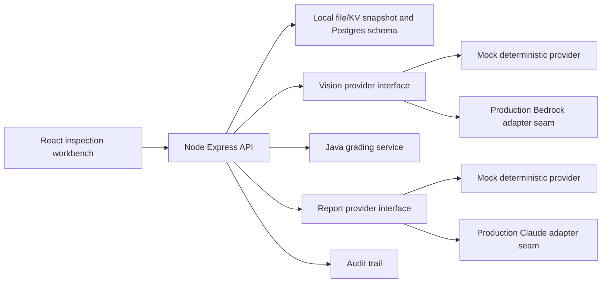

# Architecture

InspectIQ is a monorepo with a React/Vite frontend, TypeScript Express API, shared Zod schemas, and a Java grading service.

The local workflow uses deterministic providers so it works without paid credentials. The data model, endpoints, and Terraform skeleton map to Postgres, S3, SQS/EventBridge, Step Functions, workers, and Bedrock/Rekognition/custom models in AWS. The local repository persists server state to `.inspectiq/local-store.json`; Cloudflare Pages can persist to KV; production should use Postgres transactions.
