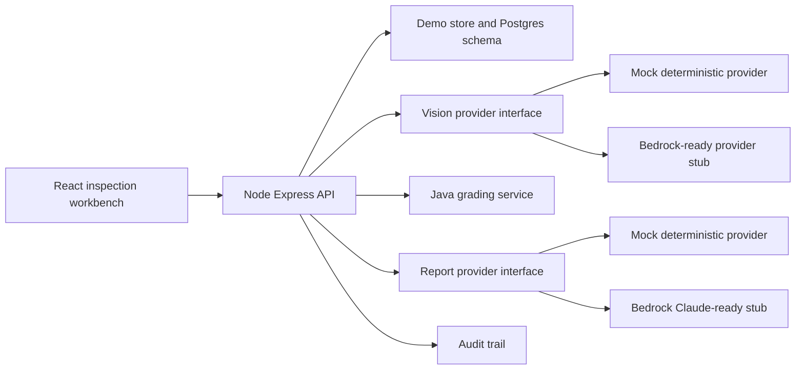

# Architecture

InspectIQ is a monorepo with a React/Vite frontend, TypeScript Express API, shared Zod schemas, and a Java grading service.

The local demo uses deterministic mock providers so it works without paid credentials. The data model, endpoints, and Terraform skeleton map to Postgres, S3, SQS/EventBridge, Step Functions, workers, and Bedrock in AWS.

