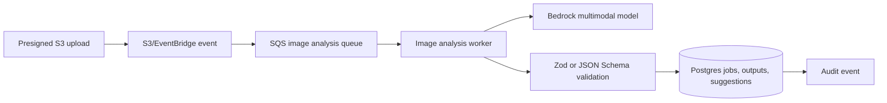

# Image Processing

Local flow:

1. Attach required photo evidence or upload a vehicle photo.
2. Validate upload type and size. Production upload paths accept JPEG, PNG, and WebP; local browser-preview fallback is intentionally smaller.
3. Store S3-style object metadata on the inspection.
4. In presigned mode, require scoped object bucket/key, byte size, and SHA-256 checksum metadata before creating the photo record.
5. Create an `image_analysis_jobs` row with queued status and idempotency key.
6. Run the selected vision provider.
7. Validate output against `VisionOutputSchema`.
8. Save raw output and validated output separately.
9. Create pending suggestions for angle, image-quality retakes, damage candidates, and extracted text.
10. Require human accept, reject, or edit.

Production AWS flow:

Job statuses:

- `queued`
- `running`
- `completed`
- `failed`
- `dead_letter`

Contract fields:

- required angle and confidence;
- image-quality grade, blur score, exposure score, framing score, resolution score, occlusion risk, and retake-required flag;
- damage candidate location, type, severity, confidence, explanation, and repair estimate range;
- OCR values for odometer and VIN;
- human-review routing.

AI/ML boundary:

- Bedrock multimodal output is advisory. It can classify angle, summarize visible damage, extract text, and produce structured suggestions.
- Photo-card angle/evidence confidence is not damage confidence and must not be read as "no damage detected."
- Buyer-visible damage facts require reviewer confirmation.
- Production launch should pair Bedrock reasoning with evaluated image-quality, angle, OCR, and damage-detection models when calibrated damage decisions are required.
