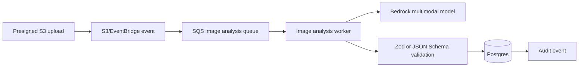

# Image Processing

Local flow:

1. Attach required photo evidence or upload a vehicle photo.
2. Store S3-style object metadata on the inspection.
3. Run the selected vision provider.
4. Validate output against `VisionOutputSchema`.
5. Save raw output and validated output separately.
6. Create pending suggestions for angle, image-quality retakes, damage candidates, and extracted text.
7. Require human accept, reject, or edit.

Production AWS flow:

Contract fields:

- required angle and confidence;
- image-quality grade, blur score, exposure score, framing score, resolution score, occlusion risk, and retake-required flag;
- damage candidate location, type, severity, confidence, explanation, and repair estimate range;
- OCR values for odometer and VIN;
- human-review routing.
